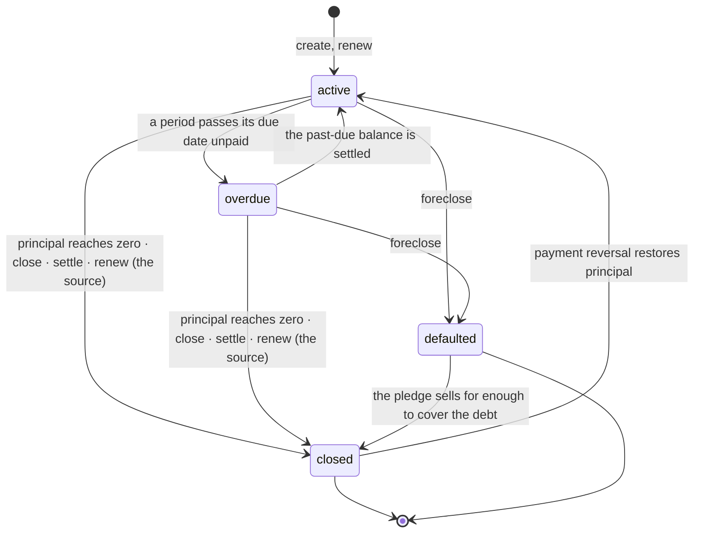

# The loan status model

`LoanStatus` has four values. This is what each one means, what moves a loan between them, and
who owns each transition — written down because the answer used to be spread across the
interest cycle, three payment routes, four operator actions and a collateral sale, with no
single place saying which was authoritative.

It is also the source for the words shown on screen and on printed documents; see
[§5](#5-what-each-state-is-called).

---

## 1. The four states

| State | Means | Who owns it |
| :--- | :--- | :--- |
| `active` | Open, and **no billing period is past its due date**. The loan may owe interest and principal — it is simply not late. | Derived. `refresh_overdue_loan_statuses` |
| `overdue` | Open, and **at least one billing period is past its due date with a balance outstanding**. | Derived. `refresh_overdue_loan_statuses` |
| `closed` | The debt is finished, or has been declared finished. | An operator action |
| `defaulted` | The lender has stopped collecting through interest and will collect through the pledge. | `POST /loans/{id}/foreclose` |

**`active` and `overdue` are derived, not decided.** Nothing should ever set them by hand: they
are a function of the interest ledger, and the only writer is
[loan_status.py](../apps/api-server/src/modules/finance/loan_status.py). `closed` and
`defaulted` are decisions, and only an operator makes them.

Two facts that are easy to assume and are wrong:

- **A `closed` loan can still owe interest.** `pay_principal` closes a loan the instant its
  principal reaches zero, so paying with `allow_with_unpaid_interest` leaves a closed loan with
  live `InterestCharge` rows. That debt is real and is still collected.
- **`interest_paused` is not a status.** A paused loan is still `active` or `overdue`; the
  pause only stops *new* charges and *new* penalties. Interest already billed stays owed and can
  still turn the loan `overdue` — a pause is an agreement about what comes next, not a way to
  make existing arrears disappear from the reports.

---

## 2. What moves a loan

### Every writer of `Loan.status`

| # | Site | Transition | Trigger |
| :-- | :--- | :--- | :--- |
| 1 | `loans/router.py` · `create_loan` | → `active` | A loan is opened |
| 2 | `loans/router.py` · `renew_loan` | → `active` | The new loan |
| 3 | `loans/router.py` · `renew_loan` | → `closed` | The source loan, with its outstanding zeroed |
| 4 | `loans/router.py` · `close_loan` | → `closed` | Operator, with a reason when it still owes |
| 5 | `loans/router.py` · `foreclose_loan` | → `defaulted` | Operator, pawn loans only |
| 6 | `payments/router.py` · `pay_principal` | → `closed` | Principal reached zero |
| 7 | `payments/router.py` · `create_payment` | → `closed` | Principal reached zero (legacy path) |
| 8 | `payments/router.py` · `reverse_payment` | `closed` → `active` | Restored principal put it back above zero |
| 9 | `collateral/router.py` · `sell_collateral` | → `closed` | Proceeds covered the whole debt |
| 10 | `finance/settlement.py` · `settle_loan` | → `closed` | Negotiated settlement |
| 11 | `finance/loan_status.py` | `active` ↔ `overdue` | Derived from the ledger |

Rows 1–10 are decisions or consequences of money moving. Row 11 is the only derivation, and it
is the only one allowed to write `active` or `overdue` on an existing loan.

---

## 3. Neither `closed` nor `defaulted` is terminal

The code used to claim both were, and in two places that was already false. Both exits are
deliberate:

- **`closed` → `active`**, when reversing a payment restores principal above zero. A loan
  closed by a payment that turned out to be a mistake has to come back; the alternative is a
  live debt sitting in a terminal state.
- **`defaulted` → `closed`**, when the pledge sells for enough to cover everything. The credit
  ended up settled, and `closed` describes that better than `defaulted` does.

What *is* guaranteed: the derived sweep never moves a loan out of `closed` or `defaulted`.
`MANAGED_STATUSES` is `(active, overdue)` and everything else is invisible to it — which is what
lets `pay_principal` close a loan and immediately run the refresh without the refresh undoing it.

---

## 4. When the derivation runs

`refresh_overdue_loan_statuses(db, as_of_date, loan_ids=None)` — unscoped it sweeps every managed
loan; scoped it re-examines a known set. Narrowing changes which loans can transition, never how
one is judged: `pending_interest_for_loans` nets each customer's whole book internally, so a loan
reaches the same verdict either way.

| Caller | Scope | Why |
| :--- | :--- | :--- |
| `run_interest_generation_cycle` | everything | Reacting to the calendar, not to an event |
| `POST /interest/generate` | everything | The same cycle, run by hand |
| `pay_interest` | the customer's **whole book** | Allocation is oldest-first across every loan they hold and the advance pool is theirs, so paying on one loan can settle a period on another |
| `pay_principal` | the loans it touched | Principal cannot by itself make a loan overdue; this is here so the rule holds without exception |
| `reverse_payment` | the loans it touched | Putting the debt back must put the label back |

**The rule: every money path leaves the status correct before it commits.**

It used to run only inside the interest cycle, so the label lagged the money by up to
`AUTO_INTEREST_GENERATION_INTERVAL_MINUTES` — **a full day at the default of 1440**. A customer
paid their arrears at the counter, took a receipt, and the loan still read `overdue` until the
next night's run. That is the defect this section exists to prevent returning.

The transition is recorded inside the payment's own audit entry (`to_overdue=[…],to_active=[…]`)
rather than as a separate row, so the change travels with the event that caused it.

---

## 5. What each state is called

One stored value, two audiences, and therefore two vocabularies. Both live in
[utils/loanStatus.ts](../apps/web-client/src/utils/loanStatus.ts); three views had each grown
their own copy before that.

| Stored | On screen (operator) | On a printed document (customer) |
| :--- | :--- | :--- |
| `active` | Activo / Active | **Al día / Up to date** |
| `overdue` | Vencido / Overdue | En mora / Overdue |
| `closed` | Cerrado / Closed | Saldado / Settled |
| `defaulted` | Incumplido / Defaulted | Ejecutado / Foreclosed |

The operator's screens name the **lifecycle** — "active" means open and on the books, which is
the right word beside a filter and a portfolio count.

A printed document is read by the customer, who is not asking which lifecycle state their loan
occupies. They are asking whether they owe anything today, and that is exactly what `active`
asserts: no billing period is past its due date. So the document says **"al día"**. Printing
"Activo" answered a question nobody had and left the real one unanswered.

Neither vocabulary invents a state, and no screen may add a fifth word for a fourth value.

---

## 6. Checks

- [test_loan_status.py](../apps/api-server/tests/test_loan_status.py) — the derived sweep.
- [test_loan_status_after_payment.py](../apps/api-server/tests/test_loan_status_after_payment.py)
  — the money paths: arrears cleared at the counter, a partial payment that must *not* clear,
  one loan cleared by a payment on another, a reversal putting the loan back, and a closed loan
  the sweep must leave alone.
