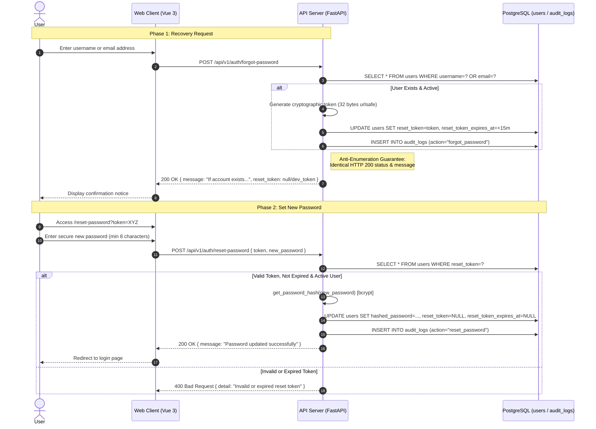

# Technical Specification: Secure Password Recovery

This document outlines the architecture, implementation details, and production-grade security guarantees of the **Password Recovery** (Forgot & Reset Password) module in the Pawn Loan Management platform.

---

## 1. Operational Flow (Architecture)



---

## 2. Database Schema

Associated Alembic Migration: `20260625_0005_user_password_reset_token.py` (Idempotent via `IF NOT EXISTS`).

| Table | Column | Data Type | Modifiers | Description |
| :--- | :--- | :--- | :--- | :--- |
| `users` | `reset_token` | `VARCHAR(255)` | `NULLABLE`, `INDEXED` | Unique temporary reset token string |
| `users` | `reset_token_expires_at` | `TIMESTAMP (UTC)` | `NULLABLE` | Exact UTC timestamp when token expires |

*Note: Once a password reset completes successfully, both fields are atomically wiped to `NULL` to prevent token replay attacks.*

---

## 3. REST API Endpoint Specifications

### 3.1. Request Recovery
- **Method & Path**: `POST /api/v1/auth/forgot-password`
- **Access Control**: Public (`Guest / Anonymous`)
- **Request Payload (`ForgotPasswordRequest`)**:
  ```json
  {
    "username_or_email": "loan_officer@company.com"
  }
  ```
- **Response (`ForgotPasswordResponse`)**:
  - **HTTP Status**: `200 OK` *(Always, to enforce anti-user enumeration)*
  - **JSON Body**:
    ```json
    {
      "message": "Si la cuenta existe y está activa, recibirás instrucciones para restablecer tu contraseña.",
      "reset_token": null
    }
    ```
    *(In `development` or `testing` environments, `reset_token` returns the token string to facilitate automated testing and local inspection).*

### 3.2. Execute Password Reset
- **Method & Path**: `POST /api/v1/auth/reset-password`
- **Access Control**: Public (`Guest / Anonymous`)
- **Request Payload (`ResetPasswordRequest`)**:
  ```json
  {
    "token": "d8f9a7c3e2b1...",
    "new_password": "SecurePassword2026!"
  }
  ```
- **Possible Responses (`ResetPasswordResponse`)**:
  - **Success (`200 OK`)**:
    ```json
    { "message": "Contraseña actualizada exitosamente" }
    ```
  - **Token Error (`400 Bad Request`)**:
    ```json
    { "detail": "Token de restablecimiento inválido o expirado" }
    ```

---

## 4. Production Cybersecurity Best Practices

When deployed via `docker-compose.prod.yml`, the system enforces strict cybersecurity protections:

1. **Immunity Against User Enumeration (*Anti-User Enumeration Guarantee*)**:
   - External attackers often submit massive email lists to discovery endpoints to verify registered platform users.
   - The backend neutralizes this by enforcing uniform processing logic and returning the **exact same HTTP 200 status code and message** regardless of whether the identifier matches an active user or `None`.
2. **Zero Production Token Leakage (*Token Exposure Hiding*)**:
   - The API evaluates `settings.app_env`. If running in `"production"` mode, the `reset_token` JSON field is strictly forced to `null`. Intercepting HTTP network traffic yields zero sensitive secrets.
3. **High Cryptographic Entropy**:
   - Reset tokens are generated using `secrets.token_urlsafe(32)`, providing 256 bits of cryptographically secure randomness (inmune to brute-force or PRNG prediction attacks).
4. **Strict Expiration Window (15 Minutes)**:
   - Tokens expire strictly 15 minutes after issuance (`datetime.now(timezone.utc) + timedelta(minutes=15)`).
5. **Single-Use Wiping & Audit Logging**:
   - Upon successful redemption, the database transaction updates the bcrypt password hash and wipes the token (`reset_token = None`).
   - Both recovery requests and password resets invoke `write_audit()`, capturing comprehensive traceability (IP address, timestamp, User ID) in the `audit_logs` table.

---

## 5. Frontend Components (Vue 3 Client)

- **Dedicated Views**:
  - [ForgotPasswordView.vue](file:///c:/Personal/pawn-loan-platform/apps/web-client/src/views/ForgotPasswordView.vue): Identifier input form featuring feedback notices and development mode helper links.
  - [ResetPasswordView.vue](file:///c:/Personal/pawn-loan-platform/apps/web-client/src/views/ResetPasswordView.vue): Double password confirmation form with reactive validation (min length `>= 8` and exact match) before dispatching API requests.
- **Router ([index.ts](file:///c:/Personal/pawn-loan-platform/apps/web-client/src/router/index.ts))**:
  - Routes protected with `meta: { guestOnly: true }` guard to prevent authenticated users from accessing recovery pages.
- **Internationalization (i18n)**:
  - All UI strings, errors, and feedback messages are bilingual (Spanish & English) in `messages.ts`.
